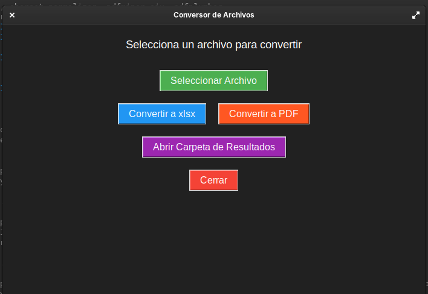
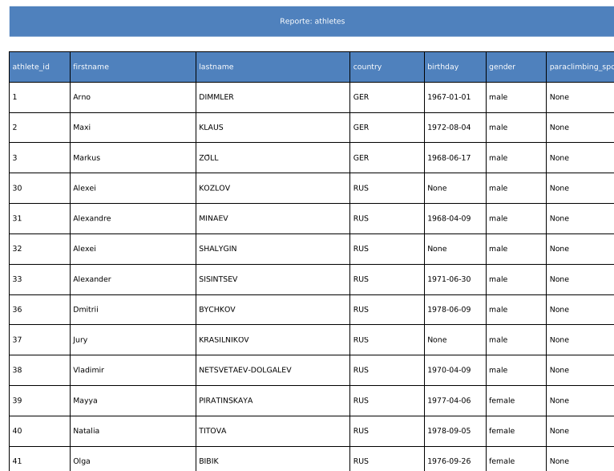

# PyExcel Convert

PyExcel Converter es una herramienta gráfica para convertir archivos (CSV, Excel, JSON, PDF) a xls,xlsx generación de informes.

## 📌 Características
  - CSV ↔ Excel
  - Exel ↔ PDF
  - JSON ↔ Excel
  - PDF → Excel (Solo PDF con tablas claras)

## Que use?
   - Python 3.8+
   - Polars: Procesamiento rápido de datos.
   - fpdf2: Generación de PDFs.
   - pdfplumber: Extracción de tablas desde PDFs.
   - Tkinter: Interfaz gráfica.

## 📦 Instalacion
git clone https://github.com/JahirWH/PyExcelConvert.git

cd PyExcel-Converter

## Intala las dependencias con:

pip install -r requirements.txt

## Usar 
Linux- /bin/python3 ./PyExcel.py

windows - acede a la carpeta y solo ejecuta PyExcel.py

